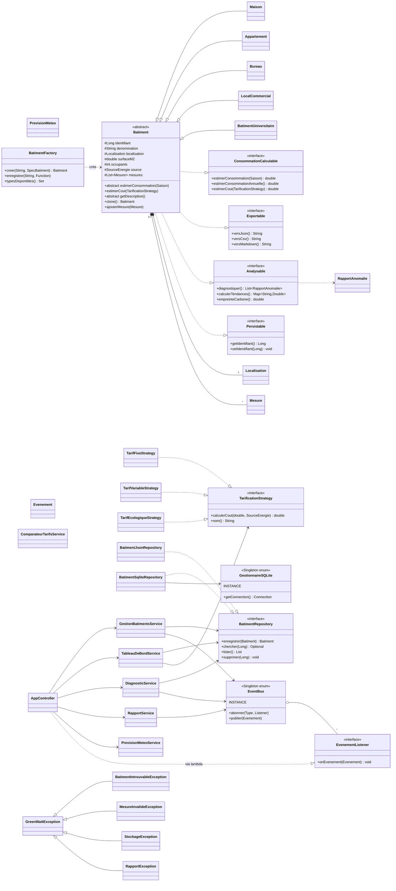
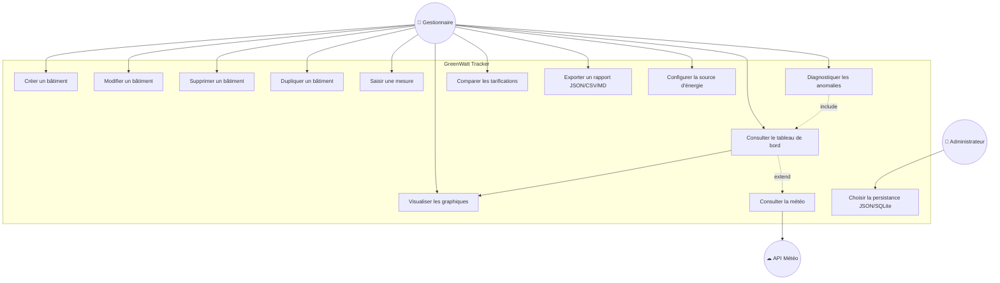
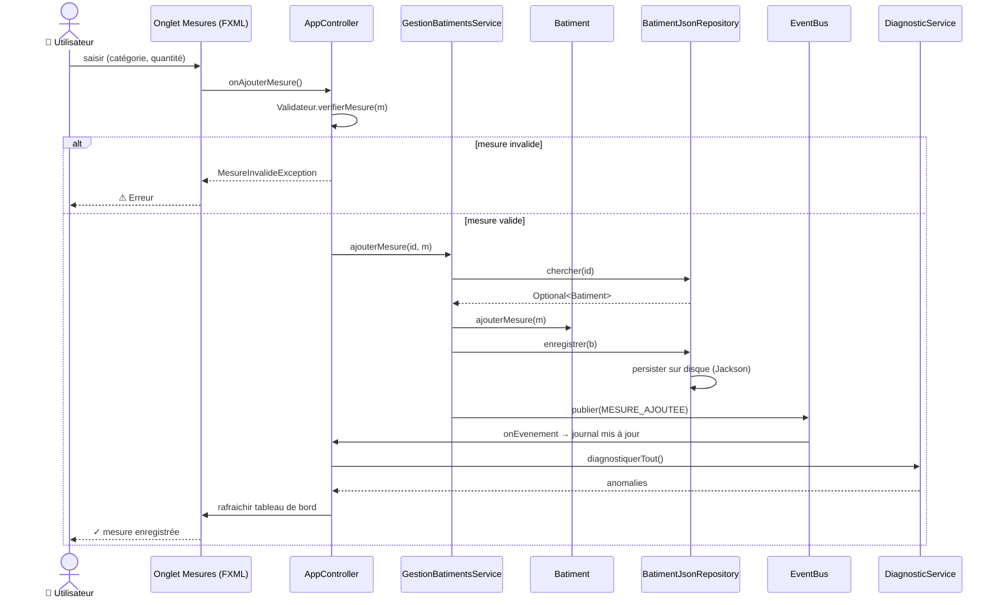

# 🌱 GreenWatt Tracker

Application JavaFX 21 / Java 17 / Maven pour le suivi **écologique** des bâtiments et de leur empreinte énergétique.

## 🚀 Lancement

```bash
cd greenwatt-tracker
mvn javafx:run
```

## 🧪 Tests

```bash
mvn test
```

## 📁 Architecture

```
fr.greenwatt
├── model/         Batiment (abstract), Maison, Appartement, Bureau, LocalCommercial,
│                  BatimentUniversitaire, AutreBatiment, Mesure, Localisation,
│                  PrevisionMeteo, Saison, SourceEnergie, CategorieEnergie, RapportAnomalie
├── interfaces/    ConsommationCalculable, Exportable, Analysable, Persistable,
│                  BatimentRepository, MesureRepository, TarificationStrategy,
│                  EvenementListener
├── factory/       BatimentFactory (mode registry)
├── strategy/      TarifFixe / TarifVariable / TarifEcologique
├── observer/      EventBus (Singleton enum), Evenement
├── repository/    BatimentJsonRepository (Jackson, par défaut),
│                  GestionnaireSQLite (Singleton enum), BatimentSqliteRepository
├── service/       GestionBatimentsService, TableauDeBordService,
│                  DiagnosticService, ComparateurTarifsService,
│                  PrevisionMeteoService, RapportService
├── controller/    AppController (JavaFX, TabPane)
├── utils/         JsonMapperFactory, Validateur, FormatUtils
└── exception/     GreenWattException + sous-types
```

## 🎯 Concepts POO illustrés

| Concept | Où |
|---|---|
| **Héritage** | `Batiment` abstrait → Maison, Appartement, Bureau, LocalCommercial, BatimentUniversitaire, AutreBatiment |
| **Polymorphisme** | `estimerConsommation(Saison)`, `estimerCout()`, `getDescription()` |
| **Abstraction** | `Batiment` abstrait, interfaces multiples |
| **Interfaces (ISP)** | `ConsommationCalculable`, `Exportable`, `Analysable`, `Persistable` |
| **DIP** | Services dépendent de `BatimentRepository`, pas de l'implémentation |
| **Factory (registry)** | `BatimentFactory` enregistre les types dans une `Map` (extensible sans modifier le code) |
| **Singleton (enum)** | `EventBus`, `GestionnaireSQLite` |
| **Strategy** | 3 tarifications interchangeables (incluant tarif écologique avec taxe CO₂) |
| **Observer** | `EventBus` notifie le contrôleur, journal d'événements en direct |
| **Prototype** | `Batiment.clone()` (clonage profond) |

## ✨ Fonctionnalités

- CRUD de 6 types de bâtiments (dont un type « Autre » paramétrable)
- Calcul saisonnier (hiver / printemps / été / automne) + facteur de zone climatique (H1/H2/H3)
- Source d'énergie par bâtiment (verte / nucléaire / mixte / fossile) → empreinte CO₂
- Mesures multi-catégories (électricité, eau, gaz, chauffage, clim, solaire)
- 3 stratégies tarifaires interchangeables
- Tableau de bord (4 KPIs + PieChart + BarChart)
- Détection d'anomalies à 3 niveaux de sévérité
- Export JSON / CSV / Markdown
- Journal d'événements en temps réel (Observer)
- Persistance JSON (Jackson) par défaut, SQLite en alternative
- Météo réelle via l'API publique **Open-Meteo** (géocodage + relevé température/couverture nuageuse), avec repli automatique en mode hors-ligne

### 🚀 Fonctionnalités avancées (bonus §6 du cahier des charges)

- **Prédiction de consommation à H+3 mois** par régression linéaire (méthode des moindres carrés) — affichée comme seconde série sur la courbe temporelle.
- **Recommandations d'économies** à 3 niveaux de priorité (🔴 élevée, 🟠 moyenne, 🟡 info), basées sur des règles métier explicables : surconsommation > 140 % de la moyenne du parc, source d'énergie fossile, déséquilibre de répartition, volatilité (coefficient de variation) élevée.
- **Simulateur de capteurs IoT** (`CapteurIoTService` + `Timeline` JavaFX) : injecte des relevés aléatoires plausibles à intervalle régulier, publiés via l'`EventBus` — utile pour démontrer en live le rafraîchissement réactif de l'IHM.

## 📊 UML — Diagramme de classes (Mermaid)



## 🧭 Cas d'utilisation (Mermaid)



## 🔄 Diagramme de séquence — ajout d'une mesure



## 🔮 Pistes d'évolution

- IA prédictive (Smile, DL4J) pour prévoir la consommation à H+30j
- Capteurs IoT via MQTT (Eclipse Paho)
- Authentification + chiffrement SQLCipher
- Mode multi-utilisateurs avec PostgreSQL
- Packaging natif via `jpackage`
